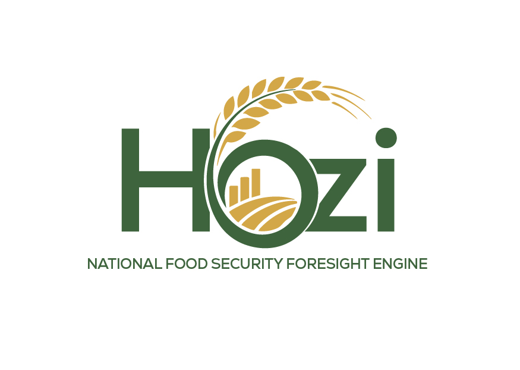
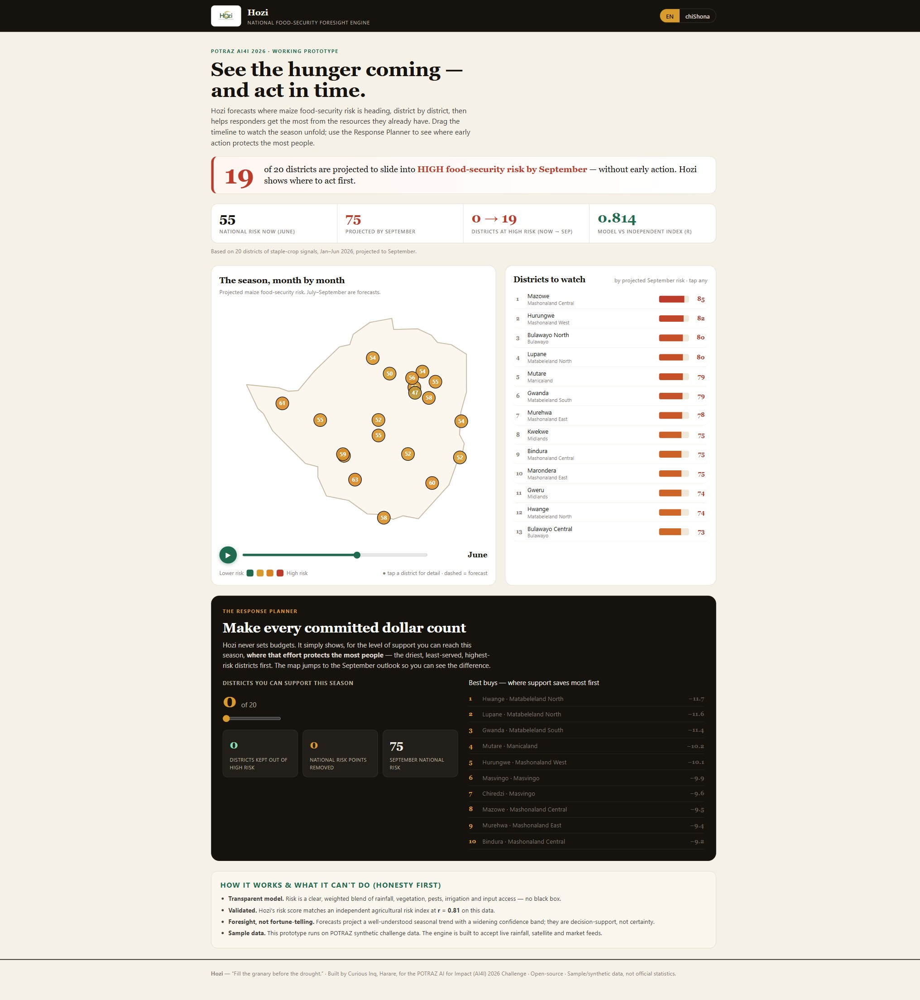

<div align="center">



# Hozi

### National Food-Security Foresight Engine

**_Fill the granary before the drought._**

*See the hunger coming — and act in time.*


</div>

---

Hozi is the **first Zimbabwean-owned food-security foresight engine.** It forecasts where maize
food-security risk is heading — district by district — then helps responders **get the most from the
resources they already have**, so early action reaches the right places *in time*.

Built for the **POTRAZ AI for Impact (AI4I) 2026 Challenge** (Development track), Hozi turns a wall of
climate and crop numbers into one clear, honest, actionable picture a Minister can read in thirty seconds.

> **Prediction is a crowded field. Prescription is not.** Global tools (WFP HungerMap, FEWS NET) tell you
> *what* will happen. Hozi helps our own planners decide *where to act first* — interactively, in local
> languages, and sovereign.

<div align="center">

</div>

---

## Why it exists

Almost every year, parts of Zimbabwe slide into food shortage when the rains fail. The tragedy is rarely
that no one saw it coming — it's that the warning arrives too late, buried in slow seasonal reports
produced outside the country, after the moment for early action has passed. Planners are then left to
stretch limited resources across many struggling districts with no quick, shared way to see where action
would do the most good.

Hozi closes that gap: **earlier warning + a clear, shared picture + help deciding where each dollar
protects the most people.**

## What it does

- 🗺️ **National risk map** — every district's staple food-security risk, on a real Zimbabwe map.
- ⏱️ **Season time-slider (Jan → Sep)** — watch risk climb into the dry season; July–September are forecasts.
- 📋 **Districts to watch** — a live ranked list by projected September risk.
- 🔎 **District drill-down** — the drivers behind each district's risk, its trajectory, and an early-warning note.
- 🎯 **The Response Planner** — for the level of support you can reach this season, Hozi ranks *where that
  effort protects the most people first* (the driest, least-served, highest-risk districts). **It never
  sets budgets** — it helps stretch the ones that exist.
- 🌍 **Local-language ready** — English + chiShona interface (isiNdebele on the roadmap).
- 🧾 **Honesty panel** — states plainly what the model can and cannot know.

## How it works

```
data (CSV / live feeds)  →  engine.py  →  projections.js  →  app (index.html)
                              │
              transparent risk model · validation · forecast · Response Planner
```

1. **Transparent risk model** — a clear, weighted blend of rainfall deficit, vegetation (NDVI), pests,
   irrigation and input access. No black box; every number is traceable.
2. **Validation** — Hozi's risk score matches an **independent agricultural risk index at r = 0.81** on the
   challenge data, so the model reflects real conditions before it projects anything.
3. **Forecast** — projects the well-understood seasonal trend 1–3 months ahead with a *widening confidence
   band*. Foresight, not fortune-telling.
4. **Response Planner** — a support package reduces risk most where irrigation is low and the district is
   dry and high-risk, so "best buys" are genuinely differentiated.

## Where the data comes from

Hozi doesn't invent data — it reads trusted signals from the bodies that already own them, and **each
owner keeps control of its own data**:

| Signal | Source | Import |
|---|---|---|
| Rainfall | Met Services · TAMSAT / CHIRPS | scheduled API pull |
| Vegetation (NDVI) | NASA · Copernicus · FAO ASIS | scheduled API pull |
| Crops · pests · inputs | Agritex / Min. of Agriculture | ministry feed + officer reports |
| Market prices | GMB · ZMX · e-Mukambo | API / upload |
| Ground truth | District officers (WhatsApp) | simple report form |
| Everything, long-term | **Project Pangolin** (national data platform) | Hozi as an analytics layer |

*This prototype runs on POTRAZ synthetic sample data. The engine is built to plug the live feeds above
straight in.*

## Quick start

No build tools, no dependencies beyond Python's standard library.

```bash
# 1. (re)generate the projections from the dataset
python engine/engine.py

# 2. open the app — either double-click app/index.html, or serve it:
cd app && python -m http.server 8000
#   then open http://localhost:8000
```

## Project structure

```
Hozi/
├── engine/engine.py     # the brain: risk model, validation, forecast, Response Planner
├── app/
│   ├── index.html       # the interactive decision-support interface
│   ├── projections.js   # engine output the app reads (also .json)
│   └── logo.jpg
├── data/                # generated projections
├── proposal/            # the 4-page AI4I solution proposal (PDF + source)
└── docs/                # logo + screenshots
```

## How Hozi is different

| | WFP HungerMap / FEWS NET | **Hozi** |
|---|---|---|
| Granularity | Country-level, global | **District-level, Zimbabwe** |
| Job | Monitor & report | **Plan & prescribe** (Response Planner) |
| Ownership | Foreign agencies | **Zimbabwean-owned, open-source** |
| Language / feel | Global, English | **Local-language, human, sovereign** |

## Responsible AI (what it can't do)

Hozi is **decision-support, not an oracle.** It keeps a human expert in the loop, shows its reasoning,
and is honest about uncertainty. It runs on synthetic sample data in this prototype, and it **does not set
budgets or override any authority** — it supports existing decision-makers and processes (ZimVAC, ministries).

## Roadmap

- **Now:** working engine + national map + Response Planner on sample data.
- **3 months:** live rainfall/satellite/market feeds, all staple crops, pilot with one ministry or NGO.
- **12 months:** national roll-out, local-language alerts to district officers, multi-hazard expansion
  (floods, disease), integration with Project Pangolin.

## Built by

**[Curious Inq](https://curiousinq.com)** — an AI-powered creative studio in Harare, Zimbabwe.
Product, design & narrative by **Nash Barara**. For the POTRAZ AI for Impact (AI4I) 2026 Challenge.

## License

[MIT](LICENSE) — free to use, extend, and build upon. Sovereign and open, by design.

---

<div align="center"><i>“Fill the granary before the drought.”</i></div>
