# Hozi — System Architecture
### AI4I 2026 · Rubric C1 (Technical Design) · ToR Architecture Diagram Requirement

---

## 1. Mermaid Diagram (flowchart LR)

The diagram follows the ToR's required sequence: users on the left, institutional data sources feeding the automation and processing layers, output reaching users via the static app and direct alerts.

```mermaid
flowchart LR

  %% ── USERS ──────────────────────────────────────────────────────────────
  subgraph USERS["Users / Beneficiary Groups"]
    U1["District officers\nZimVAC + Agritex staff"]
    U2["Ministry planners\nZimVAC secretariat"]
    U3["Public / researchers\nread-only web access"]
  end

  %% ── INSTITUTIONAL SOURCES ───────────────────────────────────────────────
  subgraph SRC["Institutional Data Sources"]
    S1["ZimVAC / IPC\nPhase outcomes"]
    S2["CHIRPS / Met Services\nrainfall dekads"]
    S3["Agritex / Min. Agriculture\ncrops + pests + inputs"]
    S4["NASA / Copernicus\nNDVI satellite"]
    S5["GMB / ZMX\nmarket prices"]
  end

  %% ── LAYER 0 ─────────────────────────────────────────────────────────────
  subgraph L0["Layer 0 — Automation  n8n  PLANNED"]
    N1["Scheduled pulls\nCHIRPS + NDVI + market"]
    N2["Watch inbox\nZimVAC / Agritex drops"]
    N3["Orchestrator\nnew data -> engine -> LLM"]
    N4["Alert dispatcher\nthreshold breach -> msg"]
  end

  %% ── LAYER 1 ─────────────────────────────────────────────────────────────
  subgraph L1["Layer 1 — Numbers  Python engine  SHIPPED"]
    E1["engine.py\ntransparent risk model\nResponse Planner"]
    E2["train_real.py\nOLS forecaster\n232-obs LODO training"]
    E3["baselines.py\npersistence + rainfall-rule\nbaseline comparison"]
    E4["projections.json / .js\nall district scores\nand forecasts"]
  end

  %% ── LAYER 2 ─────────────────────────────────────────────────────────────
  subgraph L2["Layer 2 — Reasoning  Claude API  SHIPPED"]
    C1["generate-briefs.mjs\nbatch playbook generation\nread-only input"]
    C2["briefs.js\npre-generated advisory text\nen + sn + nd  committed"]
  end

  %% ── LAYER 3 ─────────────────────────────────────────────────────────────
  subgraph L3["Layer 3 — Interface  Static App  SHIPPED"]
    A1["index.html\nnational risk map\ntime-slider + drill-down"]
    A2["cockpit.js\nResponse Planner logic\ndistrict ranking"]
    A3["i18n.js\nen / sn / nd\nlanguage switching"]
    A4["GitHub Pages\nzero build step\nno server runtime"]
  end

  %% ── SECURITY & MONITORING ───────────────────────────────────────────────
  subgraph SEC["Security and Monitoring"]
    M1["No secrets in repo\nCLAUDE_API_KEY via env\n.env.example only"]
    M2["n8n execution logs\nplanned for pilot"]
    M3["briefs.js version-controlled\naudit trail in git diff"]
    M4["Static frontend\nno user data collected\nno auth surface"]
  end

  %% ── FLOWS ───────────────────────────────────────────────────────────────
  SRC --> N1
  SRC --> N2
  N1 --> N3
  N2 --> N3
  N3 --> E1
  N3 --> E2
  N4 --> U1

  E1 --> E4
  E2 --> E4
  E3 --> E2

  E4 -->|read-only input| C1
  C1 --> C2

  E4 --> A1
  C2 --> A1
  A1 --> A2
  A1 --> A3
  A4 --- A1

  A1 --> U1
  A1 --> U2
  A1 --> U3

  SEC -.->|governs| L0
  SEC -.->|governs| L1
  SEC -.->|governs| L2
  SEC -.->|governs| L3
```



---

## 2. ASCII Fallback Diagram

For judges reading the raw file, here is the same architecture as a layered text diagram.

```
╔══════════════════════════════════════════════════════════════════════════╗
║  INSTITUTIONAL DATA SOURCES                                              ║
║  ZimVAC / IPC outcomes · CHIRPS / Met rainfall · Agritex crops+pests    ║
║  NASA / Copernicus NDVI · GMB / ZMX market prices                       ║
╚═══════════════════════════╤══════════════════════════════════════════════╝
                            │ CSV uploads + scheduled API pulls
╔═══════════════════════════▼══════════════════════════════════════════════╗
║  LAYER 0 — AUTOMATION  (n8n, self-hosted VPS)          [PLANNED]        ║
║  Scheduled CHIRPS/NDVI pulls · ZimVAC/Agritex inbox watch               ║
║  Orchestrator: new data → engine run → LLM pass → app refresh           ║
║  Alert dispatcher: threshold breach → WhatsApp / SMS / email            ║
╚═══════════════════════════╤══════════════════════════════════════════════╝
                            │ triggers engine run
╔═══════════════════════════▼══════════════════════════════════════════════╗
║  LAYER 1 — NUMBERS  (Python engine)                    [SHIPPED]        ║
║  engine.py    — transparent weighted risk model + Response Planner      ║
║  train_real.py — OLS forecaster trained on 232 real district-seasons    ║
║  baselines.py  — persistence + rainfall-rule baselines for comparison   ║
║  OUTPUT → projections.json / projections.js  (all district data)        ║
╚═════════════════╤═════════════════════════════════════════════════════════╝
                  │ projections.json passed as read-only input
╔═════════════════▼═════════════════════════════════════════════════════════╗
║  LAYER 2 — REASONING  (Claude API, batch, read-only)   [SHIPPED]        ║
║  generate-briefs.mjs — batch playbook generation, 20 districts x 3 lang ║
║  OUTPUT → briefs.js  (pre-generated advisory text, version-controlled)  ║
╚═════════════════╤═════════════════════════════════════════════════════════╝
                  │ static JS files read by browser
╔═════════════════▼═════════════════════════════════════════════════════════╗
║  LAYER 3 — INTERFACE  (static app, GitHub Pages)       [SHIPPED]        ║
║  index.html  — national risk map, time-slider, drill-down               ║
║  cockpit.js  — Response Planner, district ranking                       ║
║  i18n.js     — English / chiShona / isiNdebele switching                ║
║  No build step · No server runtime · No user data collected             ║
╚═════════════════╤═════════════════════════════════════════════════════════╝
                  │ browser + WhatsApp/SMS alerts (Layer 0 dispatch)
╔═════════════════▼═════════════════════════════════════════════════════════╗
║  USERS                                                                   ║
║  District officers + ZimVAC staff · Ministry planners · Public          ║
╚══════════════════════════════════════════════════════════════════════════╝

SECURITY & MONITORING (cross-cutting)
  - No secrets in repo; CLAUDE_API_KEY supplied via environment variable only
  - .env.example committed; actual key never committed (secrets audit 2026-07-03)
  - Static frontend: no user accounts, no personal data, no auth surface in demo
  - briefs.js version-controlled: every generation run produces an auditable git diff
  - n8n execution logs with success/failure + timestamp (planned for pilot phase)
  - Uptime monitor on static app URL (planned for pilot phase)
```

---

## 3. Component Table

| Component | Technology | Responsibility | Status |
|---|---|---|---|
| **Layer 0: n8n automation** | n8n (open-source, self-hosted, Docker) | Scheduled data ingestion; ZimVAC/Agritex inbox watch; orchestrates engine + LLM runs; dispatches WhatsApp/SMS/email alerts on threshold breaches | Planned. Designed and documented. One demo workflow (scheduled CHIRPS pull → engine trigger → alert message) in preparation for pilot. `automation/` directory not yet present in repo. |
| **engine.py** | Python 3.12, stdlib only | Transparent weighted risk model; Response Planner ranking; reads `sample_data/` or live feeds; writes `projections.json` and `projections.js` | Shipped |
| **train_real.py** | Python 3.12, NumPy, pandas, scikit-learn | OLS forecaster trained on 232 real district-season observations (IPC Phase 3+ outcomes x CHIRPS rainfall); leave-one-district-out cross-validation; writes trained coefficients used by engine | Shipped |
| **baselines.py** | Python 3.12, NumPy, pandas | Persistence baseline (prior-season district result) and rainfall-rule threshold heuristic; LODO comparison against OLS model | Shipped |
| **projections.json / projections.js** | JSON (machine-readable) + JS module wrapper | Engine output consumed by static app and generate-briefs.mjs; documented schema; all district risk scores, driver values, forecasts, Response Planner rankings | Shipped |
| **generate-briefs.mjs + briefs.js** | Node.js ESM; Claude API (claude-sonnet-4-6) | Batch playbook generation: 20 districts x 3 languages (en/sn/nd); read-only LLM input; output committed to repo as auditable static file; no API calls at browse time | Shipped |
| **index.html** | Vanilla HTML/CSS, Leaflet.js (vendored) | National district risk map; season time-slider (Jan–Sep); drill-down panel; domain rail for future health/climate modules; honesty panel | Shipped |
| **cockpit.js** | Vanilla JS | Response Planner logic; district ranking by risk x irrigation x support-package effect; reads projections.js and briefs.js | Shipped |
| **i18n.js** | Vanilla JS | English / chiShona / isiNdebele UI string switching | Shipped (en + sn + nd); native-speaker verification of sn/nd drafts pending |
| **tests/** | Python stdlib `unittest` | Unit tests for risk model, OLS forecaster, and Response Planner; run via `python -m unittest discover -s tests` | Shipped |
| **Hosting: GitHub Pages demo** | GitHub Pages (static, free) | Public demo URL: https://nash1987poli.github.io/hozi/; zero build step; no server runtime required | Shipped |
| **Hosting: VPS pilot** | 2 GB cloud VPS (DigitalOcean / Hetzner) | Runs n8n + engine on schedule; ~US$20–40/month | Planned for pilot phase post-submission |
| **Hosting: ZCHPC national** | ZCHPC CCE containerised deployment | National-scale deployment; `python:3.12-slim` + `n8nio/n8n` Docker images ready for handover | Planned — scale milestone, no hosting agreement in place |

---

## 4. Data Flow Narrative

### Layer 0 — Automation (planned)

In the pilot and national configurations, n8n runs on a self-hosted VPS and acts as the system's nervous system. It fires on a schedule to pull CHIRPS dekadal rainfall and NDVI satellite data via their respective APIs, and watches a designated inbox or folder for ZimVAC seasonal assessment drops and Agritex crop-and-pest report uploads. When new data arrives, n8n triggers a Python engine run, then — once projections are written — calls `generate-briefs.mjs` to refresh the LLM playbooks. Finally, if any district's projected risk crosses a configurable threshold, n8n dispatches a brief to the district officer's WhatsApp or SMS. This is the low-connectivity story: officers in the field receive actionable warnings without needing to open a browser. In the current prototype, Layer 0 does not yet exist as running code; it is a designed and documented architecture. A demonstration workflow (scheduled CHIRPS pull → engine trigger → alert message) is being built as an evidenced capability before submission, not as a claim of fully operational automation.

### Layer 1 — Numbers (shipped)

The Python engine is the system's sole source of quantitative truth. `engine.py` reads district signals — rainfall, NDVI, pest incidents, irrigation coverage, input availability — from `sample_data/` in the prototype (and from live feeds in the pilot configuration) and computes a transparent weighted risk score for each district across the January–September season window. `train_real.py` trains an OLS forecaster on a real panel of 232 district-season observations, cross-referencing IPC/ZimVAC Phase 3+ food-security outcomes with CHIRPS dekadal rainfall totals; this trained model projects the July–September months where observed data does not yet exist. `baselines.py` runs the same leave-one-district-out protocol on two simpler methods — a persistence baseline and a rainfall-rule threshold heuristic — so the model's added value is evidenced, not asserted. All results are written to `projections.json` (machine-readable, documented schema) and the JS-wrapped `app/projections.js`. The LLM never touches Layer 1 data — it receives these outputs as read-only inputs to Layer 2.

### Layer 2 — Reasoning (shipped)

`scripts/generate-briefs.mjs` reads `app/projections.json` and calls the Claude API (claude-sonnet-4-6) once per district in batch mode — outside of any user session. The LLM receives each district's risk timeline, driver values, and Response Planner support-package effect as structured inputs. It is instructed to produce, in each of three languages (English, chiShona, isiNdebele), a set of 3–5 ranked intervention bullets — each citing a real Zimbabwean responsible institution — and a closing sentence on urgency and forecast limits. The system prompt explicitly prohibits inventing any figure, place, or programme not present in the supplied data. The LLM output is committed to `app/briefs.js` in the repository, creating an auditable diff for every generation run. No API call occurs at browse time; judges and planners read pre-generated, version-controlled text. The LLM's advisory output never feeds back into Layer 1 scores; the architecture enforces this boundary by design. Contradiction-flagging is now shipped (2026-07-05): each district's most recent official IPC/ZimVAC Phase 3+ share is passed into the prompt alongside the model's risk picture, and the LLM flags any clear disagreement in the brief's note field for human review — see `docs/AI-USAGE-NOTE.md` §Layer 2 and the per-district notes committed in `app/briefs.js`.

### Layer 3 — Interface (shipped)

The static app runs entirely in the browser with no server-side processing and no runtime API calls. `index.html` loads a Leaflet district map of Zimbabwe; `cockpit.js` reads `projections.js` and `briefs.js` and powers the time-slider, ranked watch-list, drill-down panel, and Response Planner; `i18n.js` switches the full UI between English and chiShona (isiNdebele interface strings are a near-term milestone). An honesty panel on the dashboard discloses the model's limits, the LLM's advisory-only role, and the fact that this prototype runs on sample data. The app is served via GitHub Pages — a static host with no database, no user authentication, and no personal data collection.

---

## 5. Authentication Note

The current prototype is a public read-only demo. There are no user accounts, no login flow, and no personal data collected or stored — because there is nothing in the prototype that requires protecting. Every data file the app reads (`projections.js`, `briefs.js`) is already public in the repository.

Role-based access control — restricting officer reporting forms and administrative views to authenticated district staff — is a documented pilot milestone, not a current gap. It is deferred deliberately: implementing authentication in a prototype with no personal data and no write-capable backend would add complexity without adding protection. When officer ground-truth reporting goes live (a WhatsApp-based structured message format is the designed mechanism), the authentication boundary is the officer's registered phone number, validated by the WhatsApp Business API. Web-based role gating for administrative functions is a 60-day pilot milestone, documented in `docs/DEPLOYMENT-PLAN.md`.

The API key for the Claude service is supplied exclusively via an environment variable (`CLAUDE_API_KEY`). Only `.env.example` is committed to the repository; the actual key is never committed. A secrets audit was conducted on 2026-07-03 with no key strings found in commit history.

---

## 6. Integration Readiness Table

| Integration point | ToR requirement | Current state | Planned state |
|---|---|---|---|
| **API readiness** | Machine-readable outputs accessible to external systems | `app/projections.json` provides all district risk scores, driver values, forecasts, and Response Planner rankings in documented JSON schema. No HTTP API endpoint exists; the file is consumed directly by the static app and by `generate-briefs.mjs`. | HTTP REST endpoint wrapping the engine output is a pilot milestone. Schema is already stable and documented. |
| **Data import** | Structured data ingest from external sources | CSV import implemented: `sample_data/02_agriculture_climate_market_signals.csv` is the prototype input; `data/raw/` layout is documented for live feeds. Engine reads any CSV matching the documented column schema. | n8n scheduled pulls and inbox-watch workflows will automate delivery of live CHIRPS, NDVI, and Agritex feeds into the same CSV interface. No live feed agreements in place yet. |
| **Data export** | Outputs available for downstream use | `app/projections.json` (all district data, machine-readable); `data/real_training_panel.csv` (training panel, reproducible); engine CSVs written on each run. All outputs are plain files — no database query required. | Nightly automated export of projections JSON and engine CSVs to object storage (Backblaze B2) is a pilot milestone per `docs/DEPLOYMENT-PLAN.md`. |
| **Identity / access management** | User authentication and role separation | None in prototype. Public read-only. No personal data collected. | WhatsApp phone-number validation for officer reporting (pilot); web-based role gating for admin views (60-day pilot milestone). Data Protection Act [Ch. 12:07] compliance review is a 30-day post-submission milestone. |
| **Notifications** | Alert delivery to end users | Designed: n8n dispatches WhatsApp/SMS/email alerts when projected district risk crosses a configurable threshold. Architecture is complete. One demonstration workflow is in preparation. No live alert traffic yet. | Operational alert dispatch to 10–20 pilot users (Matabeleland South cluster) at pilot launch. WhatsApp Business API delivery receipts tracked per message. |
| **Payments** | Transaction or billing integration | Not applicable. Hozi is a public-good decision-support tool; no payment flow exists or is planned at any layer. | N/A |
| **Institutional systems** | Integration with government / sector platforms | Integration-ready design. Hozi is explicitly positioned as the analytics and decision layer on top of Project Pangolin (Zimbabwe's national data platform, National AI Strategy). Engine input schema is documented; output JSON is machine-readable. No data-sharing agreement or API access with Pangolin or any ministry feed is in place. | Integration agreements with ZimVAC secretariat and Ministry of Agriculture are the target of the pilot MOU process. Technical integration requires no engine changes — only feed credentials and n8n connector configuration. |

---

*Every "shipped" claim in this document is verifiable against committed files in this repository. Every "planned" claim is grounded in a specific milestone in `docs/DEPLOYMENT-PLAN.md` or `docs/superpowers/specs/2026-07-03-ai4i-alignment-design.md`. No claim has been upgraded between those two categories.*
